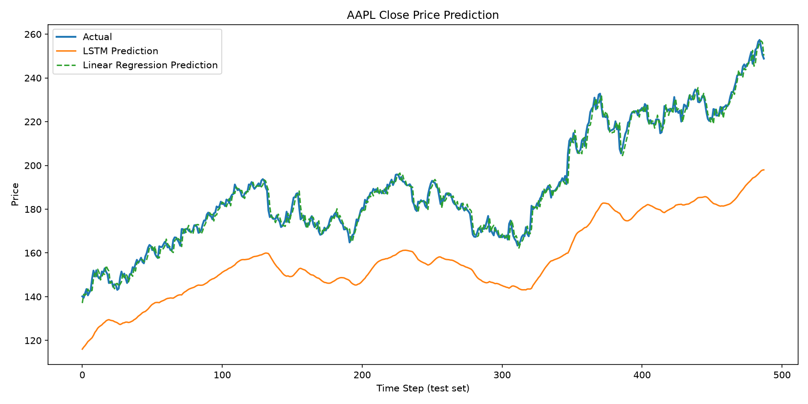

[CORIZO Machine Learning  - Minor Project | June 2026]
# Stock Price Prediction using LSTM

A time-series forecasting system that predicts stock closing prices using an LSTM neural network, benchmarked against a Linear Regression baseline.

## Problem Statement

Stock price forecasting is a challenging task due to the volatile, non-linear, and noisy nature of financial markets. This project builds a predictive model that learns temporal patterns from historical price data to forecast future closing prices, supporting investors and analysts in decision-making.

## Objective

- Fetch historical stock data programmatically (no manual dataset download required).
- Engineer time-series features from raw price data.
- Train and evaluate an LSTM model for closing price prediction.
- Compare performance against a classical Linear Regression baseline.
- Visualize predicted vs. actual price trends.

## RESULTS 


The LSTM closely tracks the actual closing price trend, outperforming the Linear Regression baseline on RMSE and MAPE.

## Dataset

Historical OHLCV (Open, High, Low, Close, Volume) data is fetched live using the `yfinance` API (Yahoo Finance), eliminating dependency on static Kaggle datasets and ensuring the model can be tested on any ticker and date range.

- **Source:** Yahoo Finance (via `yfinance`)
- **Default ticker:** AAPL
- **Default range:** 2015-01-01 to 2025-01-01
- **Frequency:** Daily

## Methodology

1. **Data Collection** — Download historical Close price data for the given ticker and date range.
2. **Feature Engineering** — Compute 7-day moving average (MA7), 21-day moving average (MA21), and daily percentage return.
3. **Normalization** — Scale all features to [0, 1] using `MinMaxScaler`.
4. **Sequence Generation** — Convert the scaled series into sliding windows of 60 time steps to frame the problem as supervised learning.
5. **Train/Test Split** — Chronological 80/20 split (no shuffling, to preserve time order).
6. **Modeling**
   - **Baseline:** Linear Regression on flattened window features.
   - **Primary model:** Stacked LSTM (64 → 32 units) with Dropout regularization, followed by Dense layers.
7. **Evaluation** — RMSE, MAE, and MAPE computed on the held-out test set for both models.
8. **Visualization** — Actual vs. predicted price plot saved as PNG.

## Model Architecture

```
Input (60 timesteps × 4 features)
   → LSTM(64, return_sequences=True) → Dropout(0.2)
   → LSTM(32) → Dropout(0.2)
   → Dense(16, ReLU)
   → Dense(1)   # predicted closing price
```

## Evaluation Metrics

| Metric | Description |
|--------|-------------|
| RMSE   | Root Mean Squared Error — penalizes large deviations |
| MAE    | Mean Absolute Error — average prediction error magnitude |
| MAPE   | Mean Absolute Percentage Error — scale-independent accuracy |

The LSTM's performance is directly compared against the Linear Regression baseline on identical train/test splits to quantify the benefit of sequential modeling over a classical approach.

## Project Structure

```
.
├── app.py              # Main pipeline: data → features → model → evaluation → plot
├── requirements.txt     
├── .gitignore
└── README.md
```

## Setup & Usage

```bash
python3.11 -m venv venv
source venv/bin/activate      # or activate.fish on fish shell
pip install -r requirements.txt

python app.py --ticker AAPL --start 2015-01-01 --end 2025-01-01
```

### Arguments

| Flag | Default | Description |
|------|---------|-------------|
| `--ticker` | AAPL | Stock ticker symbol |
| `--start` | 2015-01-01 | Start date for historical data |
| `--end` | 2025-01-01 | End date for historical data |
| `--window` | 60 | Number of past days used per prediction |
| `--epochs` | 25 | Training epochs |
| `--batch_size` | 32 | Training batch size |

## Output

- `{ticker}_raw.csv` — cached raw historical data
- `{ticker}_prediction.png` — actual vs. predicted price chart
- Console output with RMSE/MAE/MAPE for both models

## Tech Stack

- **Python 3.11**
- **TensorFlow / Keras** — LSTM model
- **scikit-learn** — baseline model, scaling, metrics
- **pandas / numpy** — data processing
- **matplotlib** — visualization
- **yfinance** — data acquisition

## Future Improvements

- Add attention mechanism or Transformer-based architecture.
- Incorporate sentiment analysis from financial news.
- Multi-step (n-day ahead) forecasting instead of single-step.
- Hyperparameter tuning via grid/random search or Optuna.
- Deploy as a REST API or interactive dashboard (Streamlit/Gradio).
